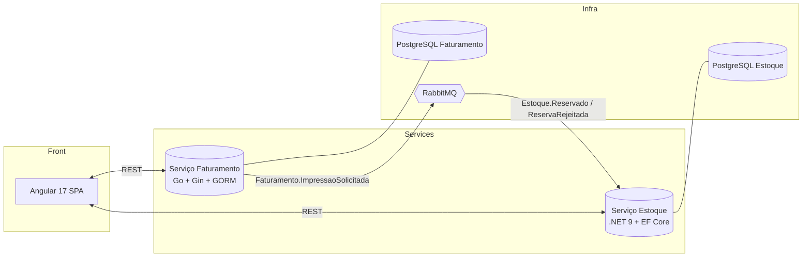
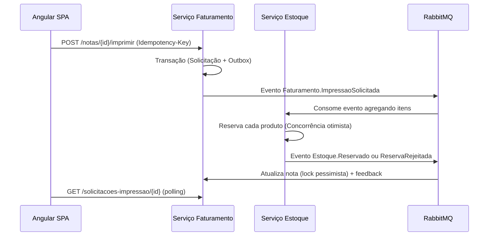

# Viasoft Korp ERP – Sistema de Emissão NFe


Microarquitetura preparada para demo técnica: dois microserviços (Go + .NET 9), RabbitMQ coreografando a saga de emissão, front-end Angular 17 com signals e scripts PowerShell que comprovam rollback, idempotência e concorrência em poucos comandos.

> **Visão rápida:** Saga Pattern + Transactional Outbox + Idempotência ponta-a-ponta, prontos para mostrar ACID distribuído em ação.

---

## 🎬 Trailer da Demo

| Fluxo Feliz | Saldo Insuficiente | Concorrência Controlada |
|-------------|--------------------|-------------------------|
|  |  |  |

> Grave os GIFs com `scripts/demo.ps1` + `ffmpeg` e mantenha-os em `docs/media/` para deixar o repositório irresistível.

---

## 🧭 Arquitetura (Mermaid)



### Sequência de Impressão



---

## ⚡ Quick Start (3 comandos)

```bash
# 1. Clone e entre no projeto
git clone https://github.com/sua-conta/Viasoft_Korp_ERP.git && cd Viasoft_Korp_ERP

# 2. Suba toda a stack (Postgres, RabbitMQ, serviços)
docker compose up -d --build

# 3. Rode a demo guiada em PowerShell
powershell -NoProfile -File .\scripts\demo.ps1
```

> Depois da demo, abra `http://localhost:4200` (ajuste `WEBAPP_PORT` se precisar de outra porta) e `http://localhost:15672` (RabbitMQ – admin/admin123).

---

## 🧪 Scripts de Verificação

| Script | Objetivo | Saída Esperada |
|--------|----------|----------------|
| `scripts/demo.ps1` | Roda os 4 cenários (feliz, saldo insuficiente, idempotência, rollback). | Resumo da demo + validação de saldo. |
| `scripts/test-rollback-final.ps1` | Garante que `X-Demo-Fail=true` reverte a transação. | HTTP 400 e saldo inalterado. |
| `scripts/test-concurrency.ps1` | Dois reservistas simultâneos (espera 1 sucesso, 1 falha). | Saldo final = 2 com logs amigáveis. |
| `scripts/validar-sistema.ps1` | Smoke test completo (opcional). | Status agregado dos serviços. |

Os scripts rodam no Windows PowerShell tradicional (ou PowerShell 7) e abortam com saída ≠ 0 em caso de falha.

---

## 🧱 Componentes Principais

### Serviço Estoque (.NET 9)
- ASP.NET Core minimal API (`ReservasController`, `ProdutosController`).
- EF Core + PostgreSQL (`xmin` para concorrência otimista).
- Outbox + BackgroundService (`PublicadorOutbox`).
- Consumidor RabbitMQ refatorado para lotes (`ReservarEstoqueLoteCommand`).

### Serviço Faturamento (Go)
- Gin + GORM (`manipulador/notas.go`).
- Transactional outbox (publicador resiliente).
- Consumo idempotente com `mensagens_processadas`.
- Tratamento de chave idempotente duplicada sem quebrar a demo.

### Front-end Angular 17
- Signals + Tailwind.
- Polling inteligente com `takeWhile`, `timeout` e feedback visual.
- Cards responsivos para 1080p com animações (habilite `BrowserAnimationsModule`).

---

## 📡 Endpoints que brilham no vídeo

| Serviço | Endpoint | Uso na demo |
|---------|----------|-------------|
| Estoque (API) | `POST /api/v1/produtos` | Cria produtos para cada cenário. |
| Estoque (API) | `POST /api/v1/reservas` | Testa `X-Demo-Fail` e concorrência. |
| Faturamento (API) | `POST /api/v1/notas/:id/imprimir` | Dispara saga + outbox. |
| Faturamento (API) | `GET /api/v1/solicitacoes-impressao/:id` | Polling de status. |
| Angular | `/produtos`, `/notas/:id` | Interface da apresentação. |

---

## 🩹 Troubleshooting Rápido

| Sintoma | Diagnóstico | Solução |
|---------|-------------|---------|
| Containers sobem mas APIs retornam 502 | RabbitMQ ainda não “healthy”. | `docker compose logs rabbitmq` e aguarde `Consumidor RabbitMQ iniciado`. |
| Logs repetem “Mensagem marcada como ignorada” | Evento antigo no broker. | Limpe a fila `estoque-eventos` no painel RabbitMQ. |
| `powershell -NoProfile -File .\scripts\demo.ps1` falha no cenário 1 | API não respondeu em 30s. | Verifique `docker compose logs servico-faturamento`; reinicie serviço. |
| Frontend sem estilos | Falta `npm install` no diretório `web-app`. | `cd web-app && npm install && npm run start`. |
| Demo precisa ser reiniciada | Deseja ambiente limpo. | `docker compose down -v && docker compose up -d --build`. |

---

## 🗺️ Roadmap e ideias para impressionar ainda mais

- [ ] Gravar GIFs reais dos 4 cenários e anexar ao repositório.
- [ ] Adicionar testes automatizados (`go test`, `dotnet test`) no pipeline.
- [ ] Coletar métricas com Prometheus + Grafana para monitorar filas/outbox.
- [ ] Gerar dashboards de logs estruturados (Serilog + Loki / OpenTelemetry).
- [ ] Empacotar front-end em Nginx para produção (`web-app/Dockerfile`).

---

## 👤 Autor & Contato

**Lucas Antunes Ferreira**  
Candidato ao estágio Viasoft Korp – Desenvolvimento C#, Go e Angular  
- LinkedIn: [linkedin.com/in/lucasantunes](https://www.linkedin.com/in/lucasantunes)  
- E-mail: lucas.antunes.dev@gmail.com  

Gostou? Vamos conversar sobre como levar essa arquitetura para produção! 🚀
